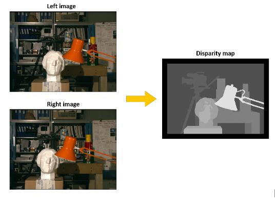
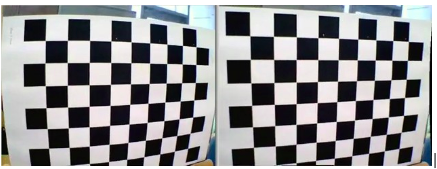
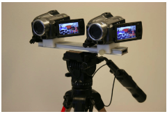
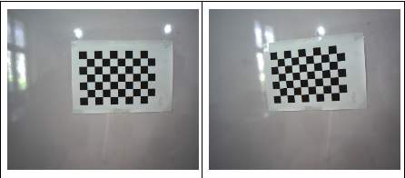
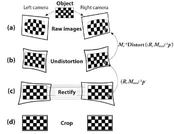
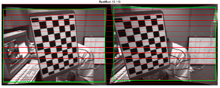

# Calculating disparity map from a stereo camera

### 1. Task Overview

---

1. Calculate the intrinsic parameters of left and right cameras
2. Calculate the extrinsic parameters (rotation and translation) between left and right cameras
3. Stereo rectification and undistortion
4. Generation of disparity map

### 2. Introduction

---

A stereo camera is a camera that has two or more image sensors. This allows the camera to simulate human binocular vision and, as a result, perceive depth. We can use a stereo vision camera setup to generate a disparity map and use it to estimate the depth of a scene.

A **disparity map** is an image where every pixel has disparity information instead of colour information. It is normally represented as a grayscale picture.

Generation of depth map from the stereo camera setup should follow certain steps. The practical sheet will guide you step by step to generate the depth map.

The generation of a disparity map from the stereo camera setup should follow certain steps.  This practical sheet will guide you through generating the disparity map. 

> **Note :**
>
> - Use Python based OpenCV library stack for the development. 
> - Store added libraries in requirements.txt file.
> - The scripts needed to complete each stage is not included into the practical sheet.

### 3. Step-by-step guide for generating the disparity map

---

#### Calculating the intrinsic and extrinsic parameters

The images captured by phones, web cameras, DSLRs, and many other commonly used camera models provide the processed images. But the images taken from the camera before the processing are distorted, similar to following Figure.

These distorted images should be corrected before being fed into the disparity map algorithms. The intrinsic parameters and distortion coefficients of the camera need to be identified to correct these distortions. OpenCV has an algorithm dedicated to identifying these unknown parameters. 

Since you are working with a stereo camera setup, you have to identify the intrinsic parameters for both cameras. 

The process of calibrating a camera in OpenCV consists of making the computer scan a picture with a chessboard pattern and identify the internal corners several times with different pictures [link](https://docs.opencv.org/4.x/d9/d0c/group__calib3d.html).

We have created a camera setup in the lab similar to the one given in following Figure. 

> **Camera Specification**
>
> Model : Blackfly S USB | BFS-U3-51S5C-C
> 
> Frame rate : 75 fps
> 
> Resolution : 2448x2048
> 
> Megapixel  : 5 MP
> 
> Focal length : 8mm

From the left and right cameras, a series of chessboard patterns were captured and given to you. You can use these images for the calibration of the left and right cameras. Following figure shows example images from stereo cameras. The captured images are stored in [Chessboard](Chessboard) directory.

Size of one small square in horizontal direction is 22.1 mm and vertical direction is 22.2 mm.

##### **TASKS**

- [x] Convert the images to grayscale
- [x] Write a function to define the world coordinates (object points) of the chessboard pattern.
- [x] Use the findChessboardCorners() to find the chessboard corners in the left and right images. 
- [x] Use found corners to calibrate camera with stereoCalibrate() function
- [x] Find the camera parameters for both the cameras

`stereoCalibrate()` will return the following parameters:

- cameraMatrix1 - Left camera intrinsics
- distCoeffs1 - Left camera distortion coefficients
- cameraMatrix2 - Right camera intrinsics
- distCoeffs2 - Right camera distortion coefficients
- R - Rotation matrix
- T - Translation vector
- E - Essential matrix
- F - Fundamental matrix

#### Undistortion and rectification

Now, you know the intrinsic and extrinsic parameters of the two cameras. Use `stereoRectify()` and `initUndistortRectifyMap()` to convert the rotation and vertical offset into remapping matrices that can be directly used to correct the stereo pair. 

Image stereo-rectification is the process by which two images of the same solid scene undergo homographic transforms, so that their corresponding epipolar lines coincide and become parallel to the x-axis of the image. Figure 5 shows the complete process of stereo calibration.

##### **TASKS**

- [x] Use `stereoRectify()` and `initUndistortRectifyMap()` to generate rectification maps for the two cameras.
- [x] Save the camera properties to a file (for later use)

Combine the two rectified images and draw horizontal lines as in following figure to check whether the rectification is correct.

#### Generating the disparity map

Now that the cameras are fully calibrated and rectified, they can be used to generate disparity maps. There are several algorithms to calculate the disparity map from rectified images: SAD, NCC, Stereo BM and SGBM. OpenCV includes Stereo BM  and SGBM (Semi Global Block Matching). 

##### **TASKS**

- [x] Load the left and right images of the given scene
- [x] Load the camera parameters for both the cameras
- [x] Prefilter image to normalize brightness and enhance texture (to increase accuracy)
- [x] Rectify the images using loaded camera parameters
- [x] Apply the stereo matching algorithm to generate the disparity map
- [x] Save the disparity map

Implement the SAD and NCC algorithms for stereo matching and compare the results with the openCV SGBM method. Try to tune the stereo matching algorithm to generate a smooth depth map.

### 4. Additional task : Create a point cloud

---

OpenCV has a feature to project disparity maps into a 3D space via generating a point cloud. Use the disparity map generated to create a point cloud of the given scene. 

### 5. Submission

---

- Use the given folders to save the images and camera parameters appropriately. 
- Add all the libraries that you have used into the requirements.txt file.
- Add your name and index number into each python script.
- Commit and push the changes to your main remote branch.

